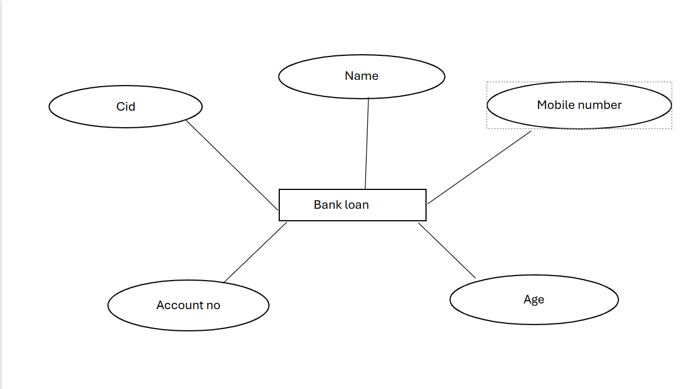

# Ex02 Django ORM Web Application
## Date: 04.11.24

## AIM
To develop a Django application to store and retrieve data from a bank loan database using Object Relational Mapping(ORM).

## ENTITY RELATIONSHIP DIAGRAM



## DESIGN STEPS

### STEP 1:
Clone the problem from GitHub

### STEP 2:
Create a new app in Django project

### STEP 3:
Enter the code for admin.py and models.py

### STEP 4:
Execute Django admin and create details for 10 books

## PROGRAM
```
admin.py

from django.contrib import admin
from .models import customer,customerAdmin
admin.site.register(customer,customerAdmin)

models.py

from django.db import models
from django.contrib import admin
class customer(models.Model):
  cid=models.CharField(max_length=20,primary_key="cid")
  name=models.CharField(max_length=50)
  mobilenumber=models.IntegerField()
  age=models.IntegerField()
  accountno=models.IntegerField()


class customerAdmin(admin.ModelAdmin):
    list_display=('cid','name','mobilenumber','age','accountno')

```

## OUTPUT


## RESULT
Thus the program for creating a database using ORM hass been executed successfully.
